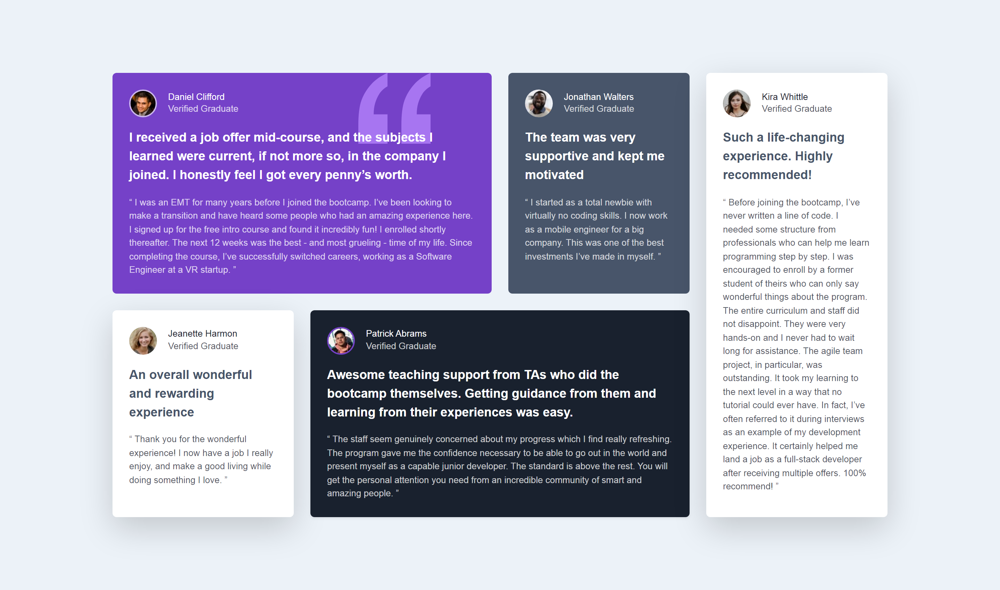

# Frontend Mentor - Testimonials grid section solution

This is a solution to the [Testimonials grid section challenge on Frontend Mentor](https://www.frontendmentor.io/challenges/testimonials-grid-section-Nnw6J7Un7). Frontend Mentor challenges help you improve your coding skills by building realistic projects.

## Table of contents

- [Overview](#overview)
  - [The challenge](#the-challenge)
  - [Screenshot](#screenshot)
  - [Links](#links)
- [My process](#my-process)
  - [Technology Used](#technology-used)
  - [What I Learned](#what-i-learned)
  - [Continued development](#continued-development)
  - [Useful resources](#useful-resources)
- [Author](#author)

## Overview

### The challenge

Users should be able to:

- View the optimal layout for the site depending on their device's screen size

### Screenshot

### Links

<!--
  * ┌───────────────────────────────────────────────────────────────────┐
  * │                      Correct the links URL                        │
  * └───────────────────────────────────────────────────────────────────┘
 -->

- **Solution:** [Add solution URL here](https://your-solution-url.com)
- **Live Site:** [Add live site URL here](https://your-live-site-url.com)

## My process

### Technology used

This project was built using the following frontend technologies and methodologies:

- **Semantic HTML5 markup:** To provide a clear and meaningful structure to the content.
- **SASS:** To write CSS more efficiently with nested rules, variables, and mixins.
<!-- ! Fix 'bootstrap' description -->
- **Bootstrap:** A popular frontend framework that provides a set of pre-designed HTML, CSS, and JavaScript components and styles. It helps developers create responsive and visually appealing websites with ease.

### What I learned

During the completion of this challenge, I learned how to utilize bootstrap's grid by enabling CSS grid classes `.grid` instead of `.row` classes. By utilizing Bootstrap, I was able to create the layout of the testimonials.

### Continued development

Moving forward, I will continue to utilize Bootstrap CSS grid to create layout ....

### Useful resources

Here are some valuable resources that I found helpful during the development of this project:

- [Bootstrap](https://getbootstrap.com): Explore the official website of Bootstrap, a powerful frontend framework widely used in web development.
- [Bootstrap Docs: SASS](https://getbootstrap.com/docs/5.3/customize/sass/): This comprehensive guide serve as a reference for customizing Bootstrap's source files using SASS, enabling greater flexibility and control over your designs.
- [Bootstrap Docs: Options](https://getbootstrap.com/docs/5.3/customize/options/): Gain insights into the multitude of options available within Bootstrap, allowing you to toggle global CSS preferences and tailor the framework to suit your specific needs.
- [Bootstrap Docs: Optimize](https://getbootstrap.com/docs/5.3/customize/optimize/): Discover techniques for optimizing your Bootstrap implementation, including tips on maintaining and delivering minified files for improved performance.
- [SASS documentation](https://sass-lang.com/documentation): The official SASS documentation serve as a valuable reference for understanding the syntax, features, and capabilities of SASS.

## Author

This project was created by **Fortune Iyoha**. If you want to connect with me or view more of my projects, you can visit my [Frontend Mentor profile](https://www.frontendmentor.io/profile/fortune-i-o) or follow me on [Twitter](https://twitter.com/fortuneiyoha) for updates and web development discussions.
